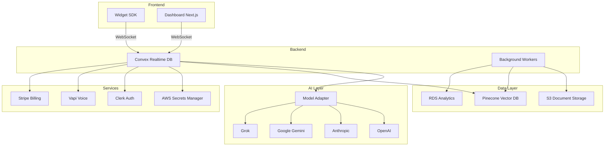

# Echo

**Production-grade, multi-tenant, AI-first customer-support SaaS**

Echo is a complete customer support platform powered by AI, featuring real-time chat, voice calls, intelligent knowledge base, and human escalation workflows.

## Architecture



## Features

- **Real-time Chat**: WebSocket-powered conversations with AI agents
- **Voice Support**: Inbound/outbound PSTN calls via Vapi integration
- **RAG Knowledge Base**: Markdown/PDF ingestion with vector search
- **Multi-tenant**: Complete org isolation with BYOK support
- **Human Escalation**: Intelligent routing to support agents
- **Multi-model**: OpenAI, Anthropic, Gemini, Grok support
- **Embeddable Widget**: < 20 kB, works in shadow DOM
- **Analytics**: Usage tracking, cost monitoring, custom reports
- **Compliance**: GDPR controls, PII redaction, audit logs

## Tech Stack

- **Frontend**: Next.js 15, React 19, Tailwind CSS 4, Shadcn/ui
- **Backend**: Convex (TypeScript), Node.js workers
- **Auth**: Clerk (multi-org, RBAC)
- **AI**: OpenAI, Anthropic, Google AI, Grok
- **Vector DB**: Pinecone
- **Voice**: Vapi
- **Infrastructure**: AWS (ECS, RDS, S3, CloudFront)
- **IaC**: Terraform
- **CI/CD**: GitHub Actions
- **Observability**: Sentry

## Quick Start

### Prerequisites

- Node.js 22+
- pnpm 9+
- Convex account
- Clerk account
- AWS account

### Installation

```bash
# Install dependencies
pnpm install

# Set up environment variables
cp .env.example .env
# Edit .env with your credentials

# Initialize Convex
cd packages/convex
npx convex dev --once
cd ../..

# Start development servers
pnpm dev
```

### Development URLs

- Dashboard: http://localhost:3000
- Widget Playground: http://localhost:3001
- Convex Dashboard: https://dashboard.convex.dev

## Project Structure

```
echo/
├── packages/
│   ├── shared/          # Shared types, utils, constants
│   ├── widget/          # Embeddable chat widget
│   ├── dashboard/       # Admin dashboard (Next.js)
│   ├── convex/          # Backend functions & schema
│   └── workers/         # Background jobs (ingestion, cleanup)
├── terraform/           # Infrastructure as Code
├── ops/                 # Dockerfiles, configs, runbooks
└── .github/             # CI/CD workflows
```

## Testing

```bash
# Run all tests
pnpm test

# Run with coverage
pnpm test:coverage

# Run E2E tests
cd packages/dashboard
pnpm cypress:run

cd packages/widget
pnpm playwright test
```

## Deployment

### Infrastructure Setup

```bash
cd terraform

# Initialize Terraform
terraform init

# Select workspace (dev/staging/prod)
terraform workspace select prod

# Plan changes
terraform plan -var-file=environments/prod.tfvars

# Apply infrastructure
terraform apply -var-file=environments/prod.tfvars
```

### Application Deployment

GitHub Actions automatically deploys on push to main:

1. Runs tests and builds
2. Creates Docker images
3. Updates ECS tasks
4. Runs canary deployment
5. Promotes to production

## Configuration

### Environment Variables

See [.env.example](.env.example) for all required variables.

### Secrets Management

All API keys are stored in AWS Secrets Manager:

```bash
# Store a secret
aws secretsmanager create-secret \
  --name echo/prod/openai-key \
  --secret-string "sk-..."

# Per-tenant BYOK
aws secretsmanager create-secret \
  --name echo/tenant/acme-corp/openai-key \
  --secret-string "sk-..."
```

## Widget Integration

### Vanilla JS

```html
<script>
  (function(w,d,s,o,f,js,fjs){
    w['EchoWidget']=o;w[o]=w[o]||function(){(w[o].q=w[o].q||[]).push(arguments)};
    js=d.createElement(s),fjs=d.getElementsByTagName(s)[0];
    js.id=o;js.src=f;js.async=1;fjs.parentNode.insertBefore(js,fjs);
  }(window,document,'script','echo','https://cdn.echo.ai/widget.js'));

  echo('init', {
    tenantId: 'your-tenant-id',
    theme: 'light'
  });
</script>
```

### React

```tsx
import { EchoWidget } from '@echo/widget/react';

export default function App() {
  return (
    <EchoWidget
      tenantId="your-tenant-id"
      theme="light"
    />
  );
}
```

## API Reference

### Convex Functions

#### `messages.sendMessage`

Send a user message and get AI response.

```typescript
const messageId = await convex.mutation(api.messages.sendMessage, {
  sessionId: "session_123",
  content: "Hello!",
  userId: "user_456"
});
```

#### `sessions.create`

Create a new conversation session.

```typescript
const session = await convex.mutation(api.sessions.create, {
  tenantId: "tenant_789",
  channel: "widget",
  metadata: { page: "/pricing" }
});
```

See [API Documentation](./docs/API.md) for complete reference.

## Monitoring

### Sentry

Error tracking and performance monitoring:

- Dashboard: https://sentry.io/organizations/echo
- Replay sessions for debugging
- Performance traces for slow queries

### Logs

```bash
# View ECS logs
aws logs tail /ecs/echo-dashboard --follow

# View worker logs
aws logs tail /ecs/echo-workers --follow
```

## Compliance

### GDPR

```typescript
// Request user data export
await convex.mutation(api.gdpr.exportUserData, {
  userId: "user_123"
});

// Delete user data
await convex.mutation(api.gdpr.deleteUserData, {
  userId: "user_123"
});
```

### Audit Logs

All actions are logged to the `auditLogs` table:

```typescript
{
  tenantId: "tenant_789",
  userId: "user_123",
  action: "conversation.escalate",
  timestamp: 1703001234567,
  metadata: { sessionId: "session_456" }
}
```

## Cost Management

### Usage Tracking

Echo tracks token usage per tenant:

```typescript
// View current month usage
const usage = await convex.query(api.usage.getCurrentMonth, {
  tenantId: "tenant_789"
});
```

### Rate Limiting

Configurable per-tenant limits:

- Messages per hour
- Tokens per day
- Storage per org

## Troubleshooting

### Widget not loading

1. Check CORS settings in Convex dashboard
2. Verify tenant ID is correct
3. Check browser console for errors

### Voice calls failing

1. Verify Vapi webhook URL is accessible
2. Check Vapi API key in AWS Secrets Manager
3. Ensure phone number is verified

### RAG not finding documents

1. Check Pinecone index exists
2. Verify namespace matches tenant ID
3. Re-run ingestion job

See [runbook.md](./ops/runbook.md) for detailed troubleshooting.

## Contributing

See [CONTRIBUTING.md](./CONTRIBUTING.md)

## Security

See [SECURITY.md](./SECURITY.md)

## License

MIT License - see [LICENSE](./LICENSE)

## Support

- Documentation: https://docs.echo.ai
- Discord: https://discord.gg/echo
- Email: support@echo.ai
